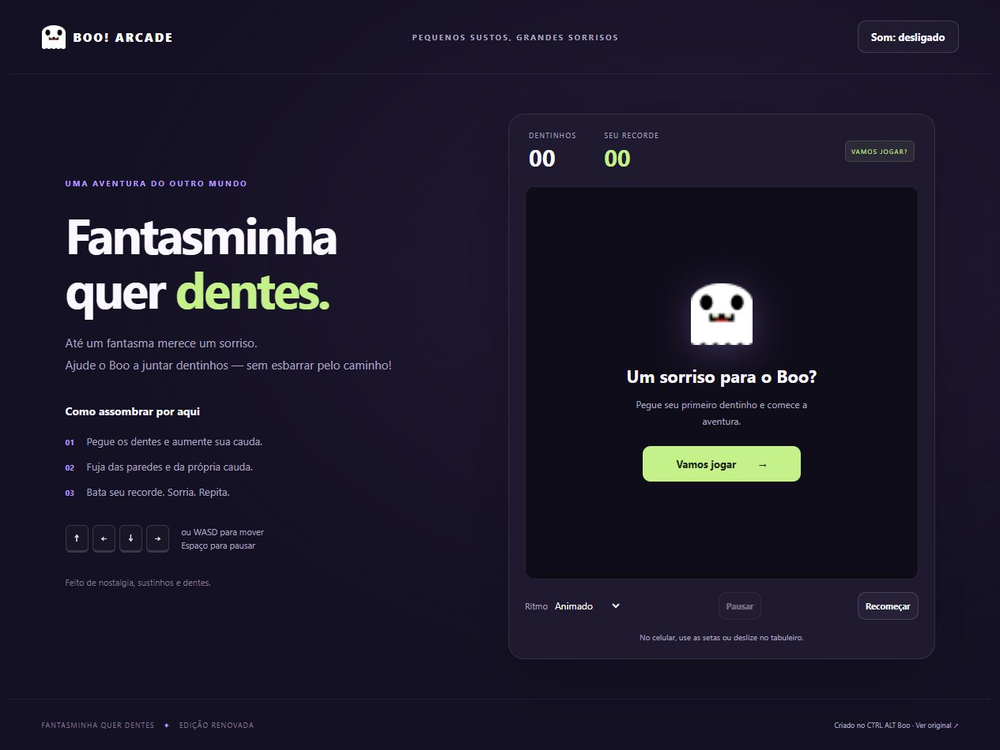
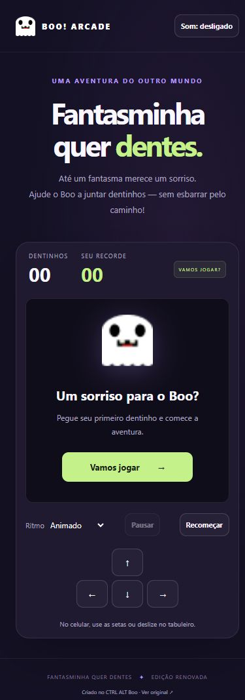

# Game_FantasminhaQuerDentes

Um pequeno fantasma, um grande sonho: colecionar dentes! Jogo de cobrinha em HTML, CSS e JavaScript, com a arte e os sons do projeto original.

## Imagens do jogo

### No computador



### No celular



## Jogar
Abra `index.html` no navegador. Não precisa instalar dependências nem compilar.

- Clique em **Vamos jogar**.
- Mova com **setas** ou **WASD**. No celular, use os botões ou deslize no tabuleiro.
- **Espaço** pausa/continua; **Esc** pausa. Também há botão de pausa.
- Escolha o ritmo antes de começar: Tranquilo, Animado ou Assombrado.
- Ative o som no botão do cabeçalho. Ele começa desligado.

## Melhorias desta edição

- Interface responsiva com identidade visual renovada e controles por toque.
- Início, pausa, retomada, reinício, fim de jogo e vitória sem alertas que bloqueiam a página.
- Recorde local persistente, com leitura do recorde antigo quando disponível.
- Três dificuldades e aceleração gradual a cada cinco dentes.
- Dentes nunca aparecem dentro da cauda; todas as 18 × 18 células são jogáveis.
- Bloqueio de inversão de direção e de múltiplas curvas no mesmo movimento.
- Pausa automática ao ocultar a aba; áudio iniciado somente por escolha do jogador.
- Foco visível, avisos acessíveis e respeito à preferência de movimento reduzido.

## Testes
Com Node.js instalado:

```sh
node --test tests/engine.test.cjs
```

Os testes cobrem colisão com parede/corpo, cauda liberada, crescimento, direção, pausa, geração de dentes e vitória. A lógica está em `js/engine.js`; interface e áudio em `js/index.js`.

## Origem e créditos

Cópia evoluída de [CtrlAltJam2023_DesafioBoo_FantasminhaQuerDentes](https://github.com/SouBeatrizKaroline/CtrlAltJam2023_DesafioBoo_FantasminhaQuerDentes), de SouBeatrizKaroline, criado durante o Halloween no CTRL ALT Boo. Histórico Git, imagens e sons originais preservados. Esta edição não adiciona uma nova licença sobre os materiais originais.
